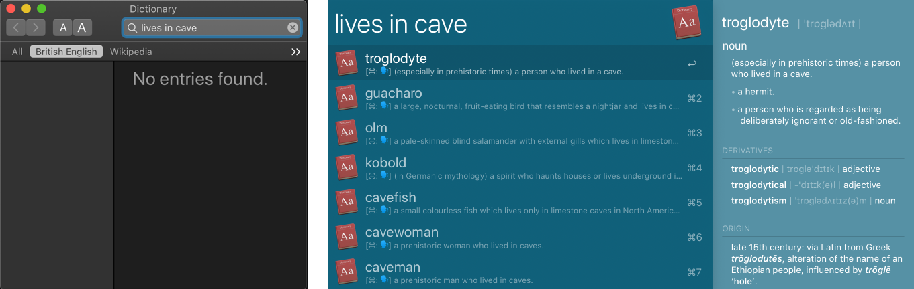
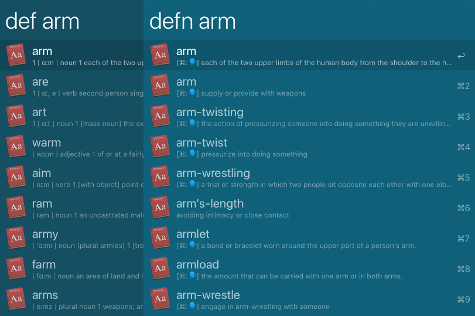
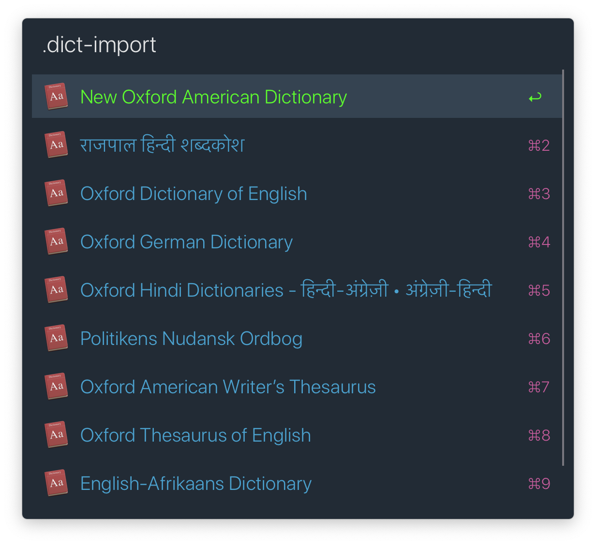
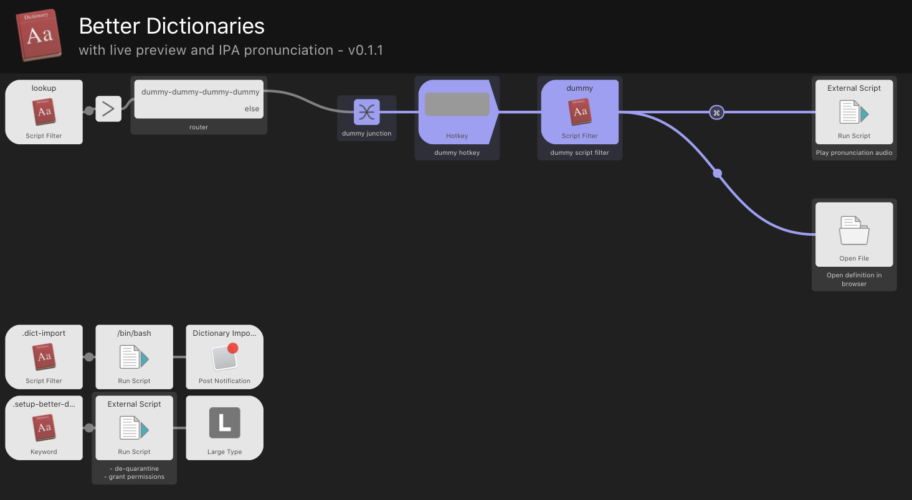
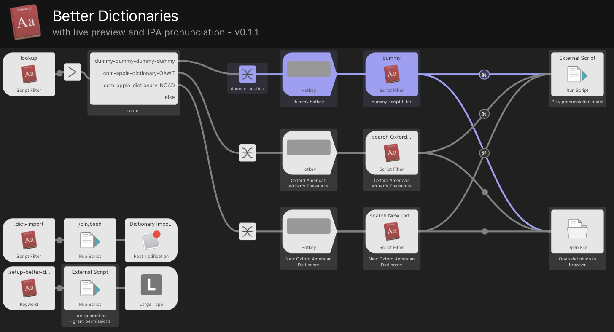
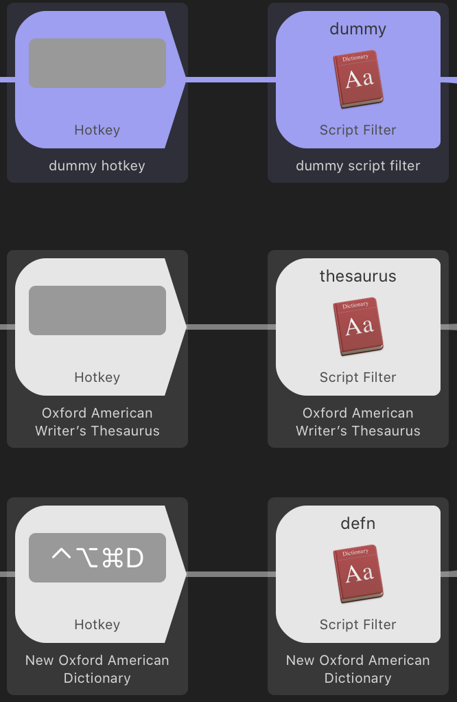
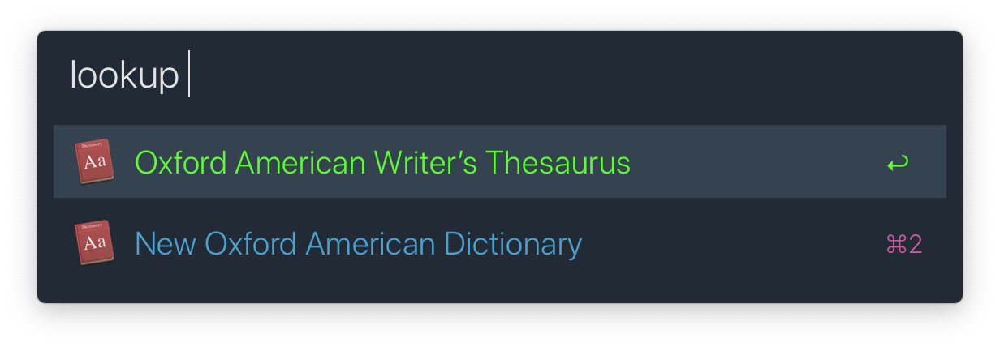

# Better Dictionaries
Better search and live previews for built-in macOS dictionaries.

### Features
 - In-Alfred live previews with colors that
   automatically adapt to Alfred's theme:
   

 - Reverse search:
   

 - More relevant search results:  
   left: macOS/Alfred built-in search, right: BetterDict
   

 - If one word has multiple, unrelated meanings with different
   origin, they are showed as diffrent entries
   (in the above example, see "arm" has two entries at the top) 

 - Import any compatible dictionary


### Setup
After importing the workflow,
first type `.setup-better-dictionaries` into Alfred
and follow the instructions for granting permissions.


### Importing a Dictionary
After setup, type `.dict-import` into Alfred.

Select the dictionary you want to import.  


### Dictionary-specific Keywords and Hotkeys
After a dictionary is imported, a script filter and a hotkey trigger
is automatically created into the workflow editor.  

 - Freshly-installed workflow without any imported dictionaries:
   

 - Two hotkeys and keyword triggers each automatically added after importing
   two dictionaries. They come pre-labeled with dictionary names:
   

 - This allows you to assign hotkeys and keywords for specific dictionaries.
   For example, below you can see how I have manually assigned keywords
   `thesaurus` and `defn` to the thesaurus and dictionary respectively.
   In addition, I can trigger the dictionary search using `⌃⌥⌘D`.
   


### Word Lookup
You can use the hotkeys/keywords created above for directly searhcing
specific dictionaries. That's the recommended way for dictionaries
that you use frequently.

For the infrequently used dictionaries for which you haven't assigned
any hotkeys/keywords, follow this:
 1. Type `lookup` into Alfred. You'll see a list of all dictionaries
    imported into BetterDict.
    
 2. Select the dictionary to search, and type the search query.


### Notes and Warnings
 - Importing a dictionary could take as much as 30 minutes
   on old machines or if there's significant CPU activity from other apps.

 - After each mac restart, for the first time when you run
   the workflow, expect a comparatively slower search.
   Subsequent searches should be instant.

 - This workflow takes a LOT of space on disk. Take a look at the comparison:
   ```md
   # Built-in dictionaries
   Oxford American Writer's Thesaurus:  7 MB
   New Oxford American Dictionary:     36 MB
   
   # After importing into BetterDict
   Oxford American Writer's Thesaurus: 101 MB (html files)
   New Oxford American Dictionary:     442 MB (html files)
   Combined search index of these two: 730 MB (apart from html)
   ```

### Known Issues
 - The workflow doeesn't work if the theme is `Alfred Classic`.  
   If you must use that theme, duplicate that theme and use the
   duplicated one.
